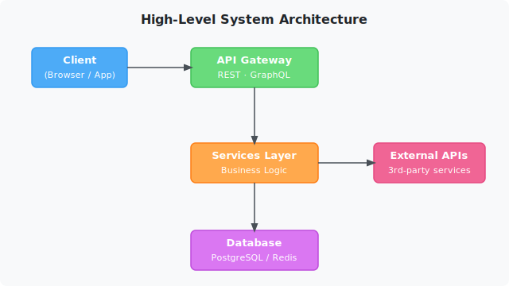

# Architecture Overview

**Section:** [Engineering](index.md)

This document describes the high-level system design, key components, and how they relate to one another.

---

## System Diagram

> The diagram above shows the four primary tiers: **Client**, **API Gateway**, **Services Layer**, and **Database**, together with connections to **External APIs**.

---

## Components

### Client

The entry-point for all user interactions. Communicates exclusively with the **API Gateway** over HTTPS.

Supported clients:

- Web browser (SPA)
- Native mobile application

### API Gateway

Centralises all inbound traffic and routes requests to downstream services. Responsibilities:

- Authentication & authorisation (JWT validation)
- Rate limiting
- Request routing — REST and GraphQL endpoints are both supported

See the full endpoint catalogue in the [API Reference](api-reference.md).

### Services Layer

Contains the business logic of the application. Services are independently deployable and communicate internally via a message bus.

Key services:

| Service | Responsibility |
|---------|----------------|
| `auth-service` | User identity and token lifecycle |
| `data-service` | CRUD operations on domain entities |
| `notify-service` | Outbound notifications (email, push) |

### Database

Persistent storage is split across two engines:

| Engine | Purpose |
|--------|---------|
| PostgreSQL | Relational data — users, entities, audit logs |
| Redis | Session cache, rate-limit counters, pub/sub |

### External APIs

Third-party integrations consumed by `notify-service` and `data-service`. Examples:

- Stripe (payments)
- SendGrid (transactional email)
- AWS S3 (object storage)

---

## Cross-References

- Detailed endpoint specifications → [API Reference](api-reference.md)
- Data schemas used by this architecture → [Sample Dataset](../datasets/sample-dataset.md)

---

## External Resources

- [The Twelve-Factor App methodology](https://12factor.net) — architectural best-practices followed by this system
- [PostgreSQL documentation](https://www.postgresql.org/docs/) — official reference for the relational database
- [Redis documentation](https://redis.io/docs/) — official reference for the cache layer
